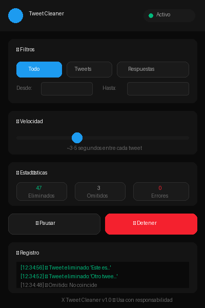

# 🧹 X Tweet Cleaner

<p align="center">
  
</p>

<p align="center">
  <strong>Elimina tweets y respuestas de tu cuenta de X (Twitter) de forma masiva y automática.</strong>
</p>

<p align="center">
  <a href="#-características">Características</a> •
  <a href="#-instalación">Instalación</a> •
  <a href="#-uso">Uso</a> •
  <a href="#-faq">FAQ</a> •
  <a href="#-contribuir">Contribuir</a>
</p>

---

## ✨ Características

- **🎯 Filtros avanzados**
  - Por tipo: tweets, respuestas, o ambos
  - Por rango de fechas
  - Por palabras clave

- **⚡ Control de velocidad**
  - 5 niveles de velocidad
  - Delays aleatorios para simular comportamiento humano

- **📊 Seguimiento en tiempo real**
  - Contador de tweets eliminados
  - Registro de actividad
  - Estadísticas de errores

- **🔒 Sin API necesaria**
  - No necesitas tokens ni pagar por la API
  - Usa tu propia sesión de navegador
  - Tus credenciales nunca salen de tu navegador

## ⚠️ Disclaimer

> **Esta extensión no está afiliada con X Corp.**
> 
> El uso de automatización puede violar los términos de servicio de X. Úsala bajo tu propia responsabilidad. X podría limitar temporalmente cuentas que detecte con comportamiento automatizado.
>
> **Recomendamos encarecidamente [descargar tus datos](https://twitter.com/settings/download_your_data) antes de usar esta herramienta.** Los tweets eliminados no se pueden recuperar.

## 📦 Instalación

### Chrome / Edge / Brave / Opera

1. **Descarga** este repositorio:
   - Haz clic en el botón verde `Code` → `Download ZIP`
   - O clona: `git clone https://github.com/tu-usuario/x-tweet-cleaner.git`

2. **Descomprime** el archivo ZIP si lo descargaste

3. **Abre la página de extensiones** de tu navegador:
   - Chrome: `chrome://extensions/`
   - Edge: `edge://extensions/`
   - Brave: `brave://extensions/`
   - Opera: `opera://extensions/`

4. **Activa el "Modo desarrollador"** (esquina superior derecha)

5. **Haz clic en "Cargar extensión sin empaquetar"** (o "Load unpacked")

6. **Selecciona la carpeta** que contiene `manifest.json`

7. ✅ ¡Listo! Verás el icono de la extensión en tu barra de herramientas

### Firefox

<details>
<summary>Instrucciones para Firefox (clic para expandir)</summary>

Firefox requiere una versión modificada del manifest. Por ahora, puedes:

1. Abre `about:debugging#/runtime/this-firefox`
2. Haz clic en "Cargar complemento temporal..."
3. Selecciona el archivo `manifest.json`

> ⚠️ En Firefox, la extensión se desactivará al cerrar el navegador. Para uso permanente, necesitarías firmar la extensión.

</details>

## 🚀 Uso

### Paso a paso

1. **Inicia sesión** en [x.com](https://x.com)

2. **Ve a tu perfil** (clic en tu foto → "Perfil")

3. **Abre la extensión** haciendo clic en su icono 🧹

4. **Configura los filtros:**

   | Filtro | Descripción |
   |--------|-------------|
   | **Tipo** | Todo, Solo tweets, o Solo respuestas |
   | **Fecha desde** | Eliminar tweets posteriores a esta fecha |
   | **Fecha hasta** | Eliminar tweets anteriores a esta fecha |
   | **Texto** | Solo eliminar tweets que contengan estas palabras |

5. **Selecciona la velocidad:**

   | Nivel | Intervalo | Riesgo |
   |-------|-----------|--------|
   | 🐢 Lento | ~8-10 seg | Mínimo |
   | 🛡️ Seguro | ~5-7 seg | Bajo |
   | ⚖️ Normal | ~3-4 seg | Moderado |
   | 🚀 Rápido | ~1.5-2 seg | Alto |
   | ⚡ Máximo | ~0.8-1 seg | Muy alto |

   > **Recomendación:** Usa "Seguro" o "Lento" para sesiones largas

6. **Haz clic en "Iniciar limpieza"**

7. **Observa el progreso** en el registro y las estadísticas

### Consejos

- 🔄 **Mantén la pestaña activa** - La extensión necesita interactuar con la página
- ☕ **Toma descansos** - Si eliminas muchos tweets, hazlo en varias sesiones
- 📱 **No uses el móvil** - Mientras la extensión trabaja, no uses X en otros dispositivos

## ❓ FAQ

<details>
<summary><strong>¿Es seguro usar esta extensión?</strong></summary>

La extensión no envía tus datos a ningún servidor externo. Todo ocurre localmente en tu navegador. Sin embargo, automatizar acciones en X podría resultar en limitaciones temporales de tu cuenta.

</details>

<details>
<summary><strong>¿Por qué no está en la Chrome Web Store?</strong></summary>

Las tiendas de extensiones tienen políticas estrictas contra herramientas que automatizan sitios de terceros. Por eso se distribuye como código abierto para instalación manual.

</details>

<details>
<summary><strong>¿Puedo recuperar tweets eliminados?</strong></summary>

No. Una vez eliminados, los tweets no se pueden recuperar. Por eso recomendamos descargar tu archivo de datos de X antes de usar la herramienta.

</details>

<details>
<summary><strong>La extensión no encuentra mis tweets</strong></summary>

- Asegúrate de estar en tu página de perfil (`x.com/tu_usuario`)
- Desplázate hacia abajo para cargar más tweets
- Verifica que tus filtros no sean muy restrictivos
- Si usas "Solo respuestas", ve a la pestaña "Respuestas" de tu perfil

</details>

<details>
<summary><strong>X cambió su diseño y la extensión no funciona</strong></summary>

X actualiza su interfaz frecuentemente. Si los selectores CSS cambian, la extensión puede dejar de funcionar. [Abre un issue](../../issues/new) y trataremos de actualizarla.

</details>

## 🛠️ Desarrollo

### Estructura del proyecto

```
x-tweet-cleaner/
├── manifest.json       # Configuración de la extensión (Manifest V3)
├── popup.html          # Interfaz de usuario
├── popup.css           # Estilos del popup
├── popup.js            # Lógica del popup
├── content.js          # Script que interactúa con X
├── content.css         # Estilos inyectados en X
├── icons/              # Iconos de la extensión
└── README.md
```

### Actualizar selectores

Si X cambia su interfaz, edita `SELECTORS` en `content.js`:

```javascript
const SELECTORS = {
  tweet: 'article[data-testid="tweet"]',
  tweetText: '[data-testid="tweetText"]',
  moreButton: '[data-testid="caret"]',
  // Actualiza estos valores según el nuevo DOM de X
};
```

### Probar cambios

1. Haz tus modificaciones
2. Ve a `chrome://extensions/`
3. Haz clic en el icono de "recargar" en la tarjeta de la extensión
4. Recarga la página de X

## 🤝 Contribuir

¡Las contribuciones son bienvenidas! 

### Formas de contribuir

- 🐛 **Reportar bugs**: [Abre un issue](../../issues/new?template=bug_report.md)
- 💡 **Sugerir funciones**: [Abre un issue](../../issues/new?template=feature_request.md)
- 🔧 **Enviar código**: Haz un fork y abre un Pull Request
- 📖 **Mejorar documentación**: Correcciones y traducciones son bienvenidas

### Guía rápida para PRs

1. Haz fork del repositorio
2. Crea una rama: `git checkout -b mi-mejora`
3. Haz tus cambios
4. Commit: `git commit -m "Añade mi mejora"`
5. Push: `git push origin mi-mejora`
6. Abre un Pull Request

## 📄 Licencia

[MIT License](LICENSE) - Puedes usar, modificar y distribuir libremente.

---

<p align="center">
  <sub>¿Te fue útil? ¡Dale una ⭐ al repo!</sub>
  <br>
  <sub>☕ <a href="https://ko-fi.com/acermax">Si te apetece, puedes invitarme a un café</a></sub>
</p>


